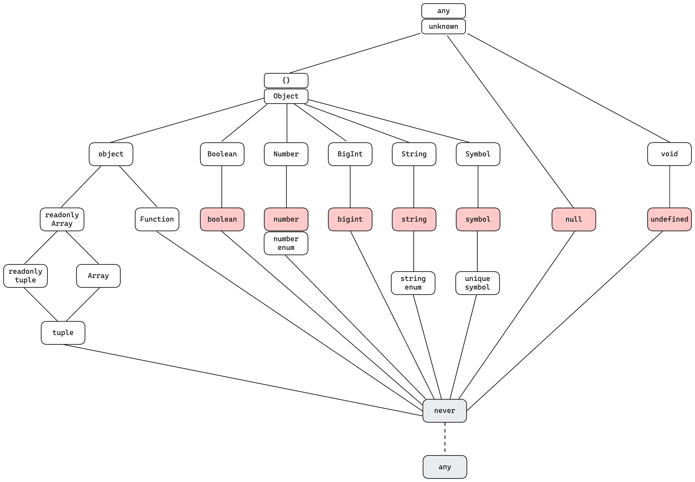
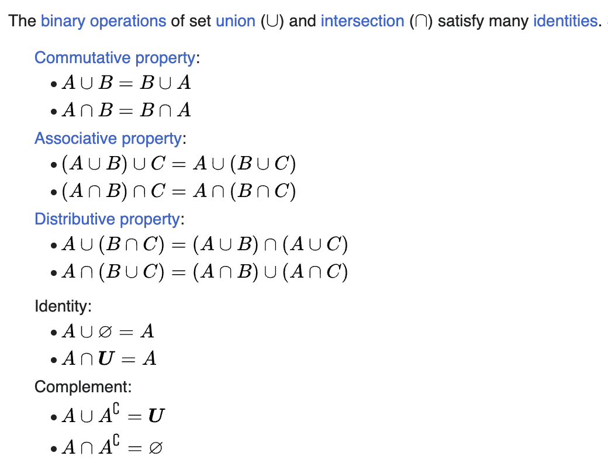

# TypeScript 类型体操手册

假设你已经有了一些碎片化的 TypeScript 知识，用 `type` 或者 `interface` 描述过常见的类型。

下面的主要内容集中在类型的操作与转换，也就是类型体操。

## Value or Type?

[查看源码](snippets/value-or-type.ts)

```ts
// Primitives
type FruitEmoji = '🍎' | '🍊' | '🥝';
const fruitEmoji = '🍎';

type Yes = true;
const yes = true;

// Enums
enum Direction {
    Up,
    Down,
    Left,
    Right
}
const direction = Direction.Up;

let myDirection: Direction;
myDirection = Direction.Left;

// Classes
const MyString = String;
const s = new MyString('yes');

function log(s: String) {
    console.log(s.toLowerCase());
}

// typeof
type S = typeof String;

const fruitMap = {
    apple: '🍎',
    orange: '🍊',
    kiwi: '🥝',
};

type Fruit = keyof typeof fruitMap;
```

- 来自 JavaScript 世界的都至少可以作为 Value
- 很多的类型身兼两职
    - 来自 JavaScript 世界的各种 Primitives 的字面量
    - 来自 TypeScript 世界的新玩意 `enum`
    - Classes 在作为值和类型时没有不像别的类型那么直观
        - 作为 Value 时，是创建对象的 Constructor
        - 作为 Type 时，描述的是对象的 Shape
- `typeof` 是 Value 进入 Type 世界的钥匙

## Duck typing

> 如果它走起来像鸭子、叫起来像鸭子，那么它就是鸭子

```ts
type 🦆 = {
    feet: number;
    swim(): void;
    fly(): void;
}
```

鸭子类型的验证只会检查其所声明的形状，也并不关心是用什么语法声明的，不论 `type` 、 `interface` 还是 `class`。更多的关于此的例子，参见 [Type Compatibility](https://www.typescriptlang.org/docs/handbook/type-compatibility.html) 文档。

[查看源码](snippets/duck-typing.ts)
```ts
type Duck = {
    feet: number;
    fly(): void;
}

interface Dragon {
    feet: number;
    fly(): void;
    dracarys(): void;
}

class Goose {
    feet: number = 2;
    fly() {}
}

type R1 = Dragon extends Duck ? true : false;
type R2 = Goose extends Duck ? true : false;
const duck: Duck = new Goose();
```

除了 `undefined`、`null` 和 `void` 这些表示空的类型，其余的类型都可以描述成特定的 `Shape`。直观的的 `Object` 们可以有 Shape，像一些特殊的类型，如 `Function` 和 `Class`，也可以用这种 Shape 来表示。

[查看源码](snippets/duck-typing-function.ts)
```ts
// Call Signatures
type F1 = (arg1: number) => boolean;
type F2 = {
    (arg2: number): boolean;
};
interface F3 {
    (arg3: number): boolean;
};

type IsSameFunc1 = Identity<F1, F2>;
type IsSameFunc2 = Identity<F1, F3>;

// Construct Signatures
type Duck = {};
type C1 = new(wings: number) => Duck;
type C2 = {
    new(wings: number): Duck;
}
interface C3 {
    new(wings: number): Duck;
}

type IsSameConstructor1 = Identity<C1, C2>; // true
type IsSameConstructor2 = Identity<C1, C3>; // true

// Compatible shape
type OneArgFn  = (a: number) => boolean;
type TwoArgsFn = (b: number, s: string) => boolean;

type Compatible = OneArgFn extends TwoArgsFn ? true : false; // true
type Compatible2 = TwoArgsFn extends OneArgFn ? true : false; // false，e.g. 一个只提供一个参数的调用的消费方，是无法给第二个参数的。
```

Note: 这里引入了一个工具函数 `Identity<A, B>` 来判断它们是否为共轭父子，即等价。

`type Identity<A, B> = A extends B ? B extends A ? true : false : false`

Note: 你可能已经注意到了，有时候用 `extends`，有时候又用赋值语句去检查两个类型是否兼容，他们有些许差异，参见[Subtype vs Assignment](https://www.typescriptlang.org/docs/handbook/type-compatibility.html#subtype-vs-assignment)。

## Type Transform

### Intersection

```ts
type SN = string & number;
type AB = {a: string} & {b: number};
type SN2 = Pick<string, 'length'> & number;
```

<details>
<summary>Types diagram</summary>

</details>

<details>
<summary>Intersection 的工作方式</summary>
<ul>
    <li>生成一个新类型，成员合并</li>
    <li>重复属性上在进行 Intersection</li>
</ul>
</details>

### Union

```ts
type Animal = Duck | Dragon;
```

Union 是更强大的 Enum 替代。


```ts
type T = {a: number} | {b: string} & {c: boolean}
```

### 整理一下可能的操作

| 类型数量 | 合并 | 剔除部分 | 取出部分 | Optional | Required |
| ------- | ------- | ------- | ------- | ------- | ------- |
| 1 | `&` | `Omit<Type, Keys>` | `Pick<Type, Keys>` | `Partial<Type>` | `Required<Type>` |
| Many | `\|` | `Exclude<UnionType, ExcludedMembers>` | `Extract<Type, Union>` | `Type \| undefined` | `NonNullable<Type>` |

### 一些额外的想法 Set theory

[集合理论](https://en.wikipedia.org/wiki/Algebra_of_sets)的分配律适用吗？



[查看源码](snippets/set-theory.ts)
```ts
type A = 1 | 2 | 3 | 4;
type B = 2 | 4;
type C = 3 | 4;

type R1 = (A & B) | C;
type R2 = (A | C) & (B | C);

type R3 = (A | B) & C;
type R4 = (A & C) | (B & C);

type R5 = Exclude<A, B> & C;
type R6 = Exclude<A & C, B & C>;
```

### 更多的类型转换

[Utility 练习](snippets/type-transform-exercise.ts)

## Type as input, Type Functions

[查看源码](snippets/type-as-input.ts)
```ts
interface Dracarysable {
    dracarys(): void;
}

type WithDracarys<T> = T & Dracarysable;

type Duck = {
    feet: number;
    fly(): void;
}
type Dragon = WithDracarys<Duck>;
```

## Conditional Types


```ts
type Duck = {
    feet: number;
    weapon: '🔥'
}

type Dragon = {
    feet: number;
    weapon:  '💦'
}

type IsDragon = Duck extends Dragon ? true : false;

// Inferring
type Weapon<T extends {weapon: any}> = T extends {weapon: infer T} ? T : never;

type DuckWeapon = Weapon<Duck>;
type DragonWeapon = Weapon<Dragon>;
```

- Type 如果符合特定的 Shape，就可以 infer 出这个 Shape 里对应位置的类型
- 给类型参数合适的 Constraints，会让最终的类型更干净，条件语句应该返回 `never`

[Utility 练习](snippets/conditional-types-exercise.ts)
```ts
// 1. 实现 `TypeOfArray<Array>` 获取数组内部的值的类型
type TypeOfArray<A> = unknown;

type InnerType = TypeOfArray<string[]>; // string

// 2. 实现 `Parameters<Type>` 获取函数的参数的类型
type MyParameters<F> = unknown;

type TestFn = (a: string, b: number) => number;
type Params = MyParameters<TestFn>; // [a: string, b: number]
```

## Type programming

类型世界相对于值的世界抽象了一个维度，而在这个类型的世界里也存在编程语言的一些基本要素。

| Basic elements of programming | Examples |
| ------------- | ------------- |
| Data Types | `undefined` `null` `string` `object` |
| Variables and Constants | `type S = string` `type GenericType<ArgVar>` |
| Operators | `A \| B` `A & B` `keyof T` |
| Control Structures | `A extends B ? C : D` `A extends Array<infer T> ? T : unknown` |
| Functions | `type GenericType<T extends string = ''> = T & U` |

[React里类型操作的小练习](snippets/type-programming-exercise.ts)，实现 `type Props = React.React.ComponentProps<Component>`

## References

- [Creating Types from Types](https://www.typescriptlang.org/docs/handbook/2/types-from-types.html)
- [Every possible TypeScript type](https://gist.github.com/laughinghan/31e02b3f3b79a4b1d58138beff1a2a89?permalink_comment_id=3241403#gistcomment-3241403)
